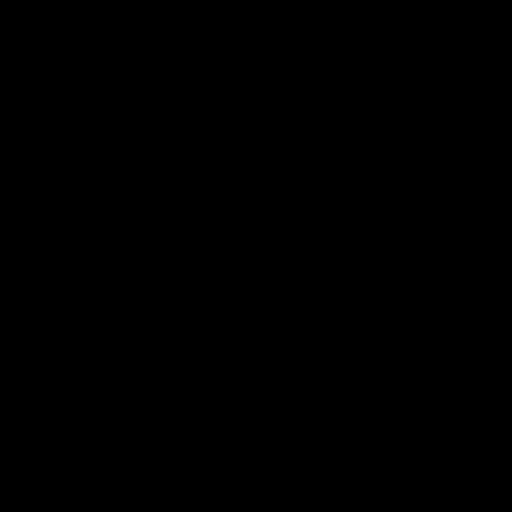
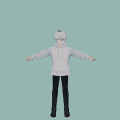
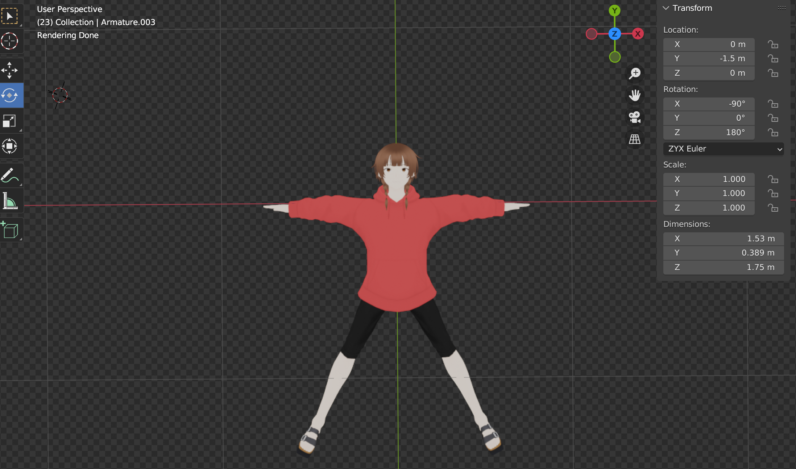
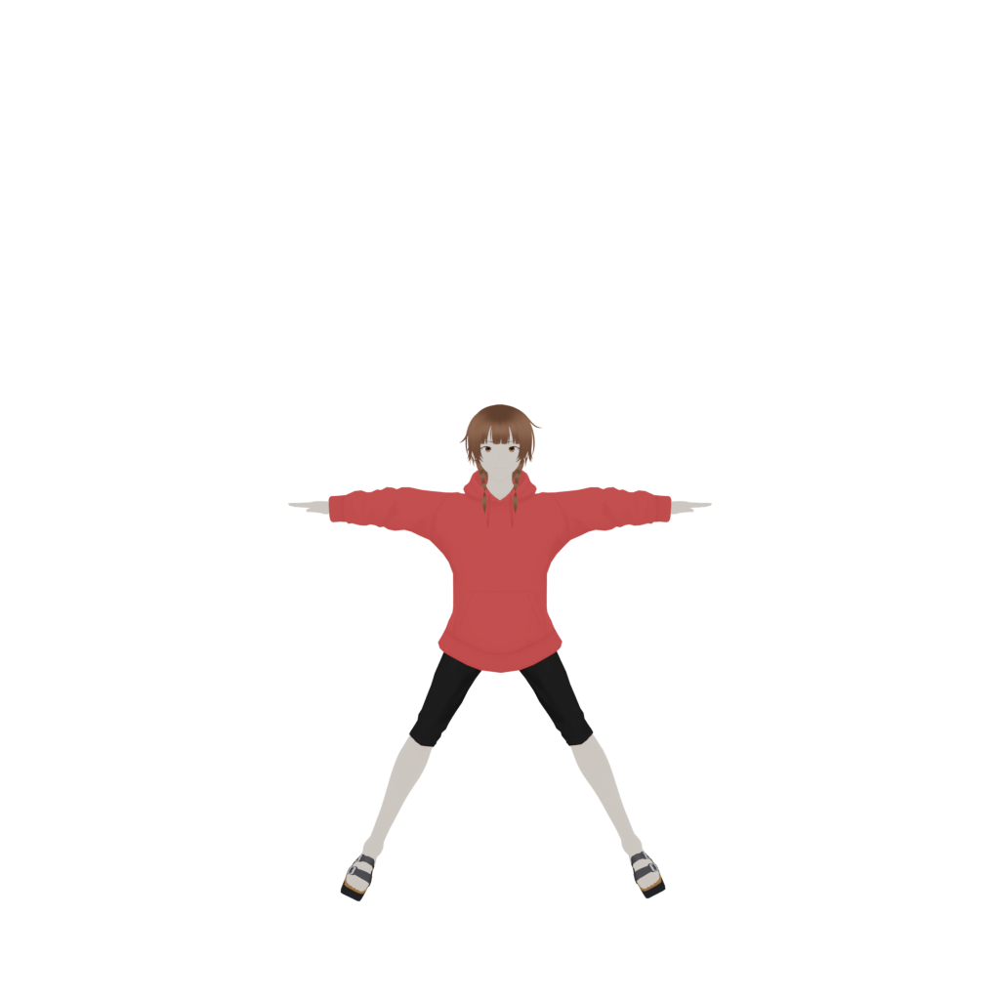
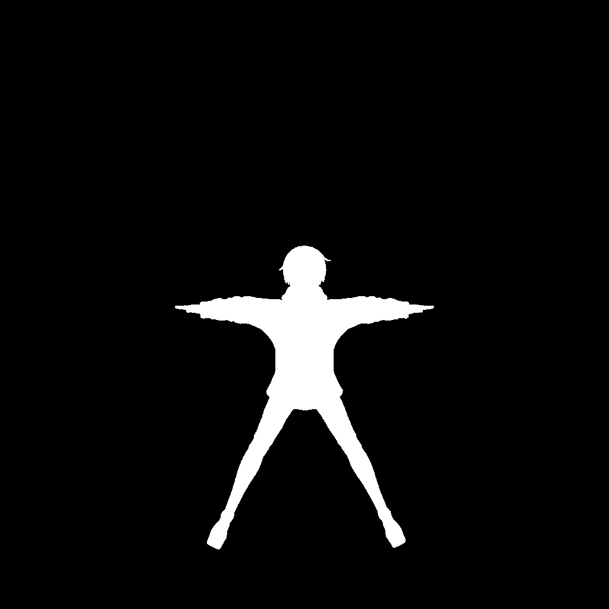

# Gaussian Avatar Animation

Modeling animatable human avatars from only Few pictures.
colmap dataset is generally reconstructed in real video scenes.
Making data sets in the realm of virtual people is difficult.
This project mainly introduces how to do avatar related 3D reconstruction. 
Useing smpl models and extended lbs for animation

## Animatable
We show avatars animated by challenging motions from [AMASS](https://amass.is.tue.mpg.de/) dataset.
<div>
  
  

</div>


## Installation

```
git clone --recursive https://github.com/heawon-yoon/anim-gaussian.git

cd anim-gaussian

conda create -n anim python=3.9 -y

conda activate anim

#torch
conda install pytorch==2.0.0 torchvision==0.15.0 torchaudio==2.0.0 pytorch-cuda=11.8 -c pytorch -c nvidia

#gaussian
pip install submodules/diff-gaussian-rasterization
pip install submodules/simple-knn

#pytorch3d
pip install fvcore iopath
git clone --recursive https://github.com/facebookresearch/pytorch3d.git
cd pytorch3d
python setup.py install
cd ..

#requirements
pip install -r requirements.txt
pip install git+https://github.com/mattloper/chumpy.git

```
  If the gaussian module fails to be installed in ubuntu. Take a look at this. This is a some problem I have met
  1. we could not find ninja or g++<br/>
        sudo apt-get update<br/>
        sudo apt install build-essential<br/>
        sudo apt-get install ninja-build

  2. No such file or directory: ‘:/usr/local/cuda-11.8/bin/nvcc.<br/>
     Execute the command directly on the current command line<br/>
        export CUDA_HOME=/usr/local/cuda<br/>
        install again<br/>
        pip install submodules/diff-gaussian-rasterization<br/>
        pip install submodules/simple-knn
   
     window OS and other problem Please refer to this project about gaussians [Gaussian-Splatting](https://github.com/graphdeco-inria/gaussian-splatting)<br/>

  3. pytorch3d problem Please refer to this project about  [pytorch3d](https://github.com/facebookresearch/pytorch3d.git)
# Preparing the datasets and models

## Datasets
- Download the SMPL neutral body model
    - Register to [SMPL](https://smpl.is.tue.mpg.de/index.html) website.
    - Download version 1.1.0 for Python 2.7 (female/male/neutral, 300 shape PCs) from the [download](https://smpl.is.tue.mpg.de/download.php) page, .
    - Extract the files and rename 
    `smpl/model/basicModel_x_lbs_10_207_0_v1.0.0.pkl` to `SMPL_x.pkl`.
    - Put the files into `./data/smpl/` folder with the following structure:

        ```
        data/smpl/
        ├── SMPL_NEUTRAL.pkl
        ├── SMPL_MALE.pkl
        ├── SMPL_FEMALE.pkl
        ```


- Download AMASS dataset for novel animation rendering:
  - AMASS dataset is used for rendering novel poses.
  - We used SFU mocap(SMPL+H G) and MPI_mosh (SMPL+H G) subsets, please download from [AMASS](https://amass.is.tue.mpg.de/download.php).
  - Put the downloaded mocap data in to `./data/` folder.

After following the above steps, you should obtain a folder structure similar to this:

```
data/
├── smpl
│   ├── SMPL_FEMALE.pkl
│   ├── SMPL_MALE.pkl
│   ├── SMPL_NEUTRAL.pkl
├── humans
│   ├── blender
│   ├── mask
│   ├── cameras.json
│   ├── point_cloud.ply
├── MPI_mosh
│   ├── 00008
│   ├── 00031
│   ├── ...
│   └── 50027
└── SFU
    ├── 0005
    ├── 0007
    ├── ...
    └── 0018
```
### Custom Data
  1. Generate avatar model from [vroid software ](https://vroid.com/en/studio)
  2. Import glb model into Blender
  3. Adjust model to Z-axis front and set the original point at the chest

  <div align="center">
  
  </div>

  4. Generate data with `./blender.py`

  1. Paste the above code from the script menu.
  2. Generate Multi-view images, masks and cameras.json file
  <div align="center">
    
    
  </div>

Then struct the generated data under floder `./data/`
```
data/
├── training_data
│   ├── cameras.json
|   ├── blender
|   |   ├── mask_xxxxxx.png
|   |   ├── image_xxxxxx.png
```
# Evaluation and Animation


```
python render_around.py
```

This command will generate 360 degree rotation video and animation video in output folder

# Training

```
python train.py -s data/humans -m ./output/0001

# Using wandb to check training results
# Wandb will automatically log to your wandb account
# Visit https://wandb.ai to view training progress and metrics
```


## Acknowledgements

This project is built on source codes shared by [Gaussian-Splatting](https://github.com/graphdeco-inria/gaussian-splatting), [ML-HUGS](https://github.com/apple/ml-hugs.git), [anim-gaussian](https://github.com/heawon-yoon/anim-gaussian).

# License
The model is licensed under the [Apache 2.0 license](LICENSE).